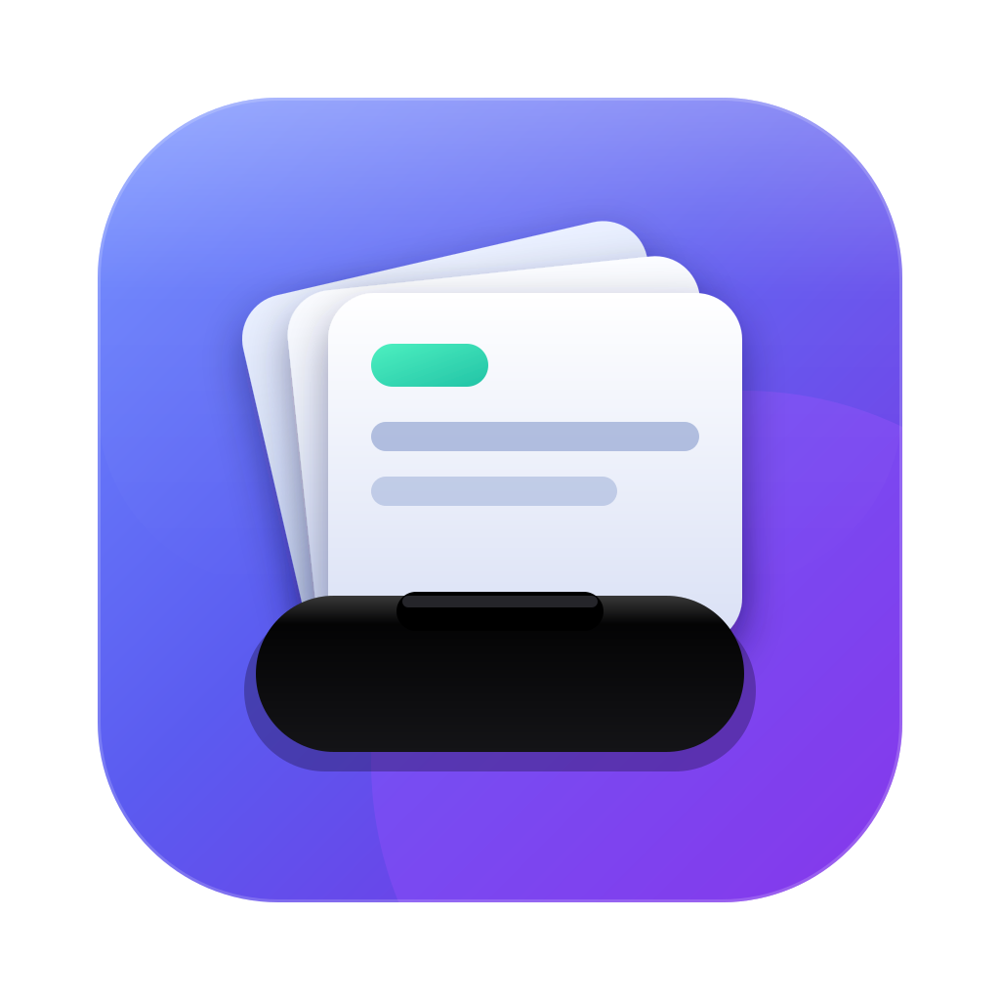

<div align="center">



# Island Vault

**Your clipboard, hidden in the notch.**

[](https://www.apple.com/macos/)
[](https://support.apple.com/en-us/HT211814)
[](#license)
[](https://github.com/pokharnajay/island-vault/releases/latest/download/Island-Vault-0.1.0-arm64.dmg)

</div>

---

Island Vault turns the dead space around your MacBook notch into a jet-black Dynamic Island that holds your entire clipboard history. Hover near the notch and a tray of cards slides out. Everything you copy — text, images, files — is captured automatically and one click away. It's a clipboard manager that stays completely out of sight until you need it, and completely on your Mac, always.

## Download

**[⬇️ Get the latest release →](https://pokharnajay.github.io/island-vault/)**

- **Download page:** https://pokharnajay.github.io/island-vault/
- **Direct `.dmg`:** https://github.com/pokharnajay/island-vault/releases/latest/download/Island-Vault-0.1.0-arm64.dmg

> **First launch (Gatekeeper):** this is an unsigned dev build, so macOS won't open it on a normal double-click. **Right-click the app → Open**, then confirm. You only have to do this once.

## Features

- 🌑 **Lives in the notch.** A jet-black Dynamic Island that blends into the bezel. Hover near the notch and the tray slides out.
- 📋 **Captures everything automatically.** Plain text, rich text, images, and files (yes, Finder copies) — all saved the moment you copy them.
- 🃏 **Horizontal card strip.** Your clips appear as cards, most recent first. Click any card to copy it straight back to the clipboard.
- 🔍 **Full-text search + keyboard nav.** Search across all clip contents instantly. Arrow keys move the selection, **Enter** copies — never touch the mouse.
- 📌 **Pin favourites.** Pinned clips are protected and never evicted.
- 🤖 **AI quick-actions on text.** Right-click a text card to **Clean up**, **Summarize**, **Translate**, or **Extract links & emails** — powered by your own local `claude` CLI. The result lands as a fresh clip at the top.
- 💾 **Permanent local storage.** Lives at `~/Library/Application Support/IslandVault` and survives app updates, renames, and reinstalls. Keeps your most recent 100 clips; older unpinned ones are auto-evicted.
- 🔒 **Privacy first.** 100% local. Skips concealed/transient clips from password managers. Nothing ever leaves your Mac.
- 🚀 **Stays out of the way.** Launches at login and runs as a background app — no Dock icon, no menu-bar clutter.

## How it works

1. **Hover the notch.** The Dynamic Island expands and the tray slides out.
2. **Scan the cards.** Your clipboard history is a horizontal strip, newest on the left. Search or arrow through it.
3. **Click to copy.** Tap a card (or press **Enter**) and it's back on your clipboard, ready to paste.

That's the whole loop. Copy anything, anywhere — Island Vault remembers it so you don't have to.

## AI quick-actions

Right-click any **text** card to run a quick-action: **Clean up**, **Summarize**, **Translate**, or **Extract links & emails**. The output becomes a new clip at the top of the strip.

These actions run through the [Claude Code](https://docs.claude.com/en/docs/claude-code/overview) CLI already installed on your machine — Island Vault simply shells out to the `claude` command. This means:

- **You need Claude Code installed** and the `claude` command available on your `PATH` for AI actions to work.
- **The processing is done by your own local CLI**, under your own account and settings.
- **Only the text you explicitly run an action on** is ever sent to it — nothing else, and never automatically.

## Privacy

Island Vault is **100% local**. Your clipboard history lives in a database on your Mac and nowhere else — there are no servers, no accounts, and no telemetry. The app deliberately **skips concealed and transient clips** (the kind password managers mark), so your secrets never get captured in the first place.

The single exception is intentional: when **you** choose an AI quick-action, the selected text — and only that text — is handed to your own locally-installed `claude` CLI. Nothing leaves your Mac unless you ask it to.

## Build from source

Requires Node.js and an Apple Silicon (arm64) Mac.

```bash
# install dependencies
npm install

# run in development
npm run dev

# build a distributable macOS app
npm run build:mac
```

The packaged `.dmg` is written to the `dist/` directory.

## Tech stack

Electron · TypeScript · React · `node:sqlite` — packaged as an Apple Silicon (arm64) macOS build.

---

<div align="center">

Made by **Jay Pokharna** · Licensed under the [MIT License](#license) · v0.1.0

[Repository](https://github.com/pokharnajay/island-vault) · [Download](https://pokharnajay.github.io/island-vault/)

</div>

## License

MIT © Jay Pokharna
